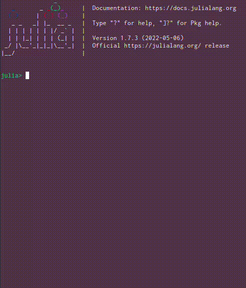

# Kroki.jl

[](https://bauglir.github.io/Kroki.jl/stable)
[](https://bauglir.github.io/Kroki.jl/latest)
[](https://github.com/bauglir/Kroki.jl/actions)
[](https://codecov.io/gh/bauglir/Kroki.jl)
[](https://coveralls.io/github/bauglir/Kroki.jl?branch=development)
[![[Semantic Release]](https://img.shields.io/badge/%20%20%F0%9F%93%A6%F0%9F%9A%80-semantic--release-e10079.svg)](https://github.com/semantic-release/semantic-release)
[](https://colprac.sciml.ai/)

Enables a wide array of textual diagramming tools, such as
[Graphviz](https://www.graphviz.org), [Mermaid](https://mermaidjs.github.io),
[PlantUML](https://plantuml.com),
[svgbob](https://ivanceras.github.io/content/Svgbob.html) and [many
more](https://bauglir.github.io/Kroki.jl/stable/#diagram-support) within Julia
through the [Kroki](https://kroki.io) service. It works in environments capable
of rendering images:


and even in the REPL for a subset of the supported diagrams:



See the [documentation](https://bauglir.github.io/Kroki.jl/stable) for more
information and please follow the [contribution guidelines](CONTRIBUTING.md)
when contributing.

## Usage

Install Kroki through Julia's package manager

```
(v1.10) pkg> add Kroki
```

Construct diagrams using the
[`Diagram`](https://bauglir.github.io/Kroki.jl/stable/api/#Kroki.Diagram) type
or any of the available [string
literals](https://bauglir.github.io/Kroki.jl/stable/api/#String-Literals). Then
either rely on the available `Base.show` overloads, or call the
[`render`](https://bauglir.github.io/Kroki.jl/stable/api/#Kroki.render)
function with a specific output format, to visualize them.

```
julia> using Kroki

julia> plantuml"""
       Kroki -> Julia: Hello!
       Julia -> Kroki: Hi!
       Kroki -> Julia: Can I draw some diagrams for you?
       Julia -> Kroki: Sure!
       """
     ┌─────┐                            ┌─────┐
     │Kroki│                            │Julia│
     └──┬──┘                            └──┬──┘
        │             Hello!               │
        │─────────────────────────────────>│
        │                                  │
        │               Hi!                │
        │<─────────────────────────────────│
        │                                  │
        │Can I draw some diagrams for you? │
        │─────────────────────────────────>│
        │                                  │
        │              Sure!               │
        │<─────────────────────────────────│
     ┌──┴──┐                            ┌──┴──┐
     │Kroki│                            │Julia│
     └─────┘                            └─────┘
```

_Note:_ ASCII art diagrams, as shown above, are only supported for a subset of
[PlantUML](https://plantuml.com) diagrams. All other diagram types are better
supported in environments like
[Documenter.jl](https://juliadocs.github.io/Documenter.jl/stable),
[Pluto.jl](https://github.com/fonsp/Pluto.jl) or
[Jupyter](https://jupyter.org).
